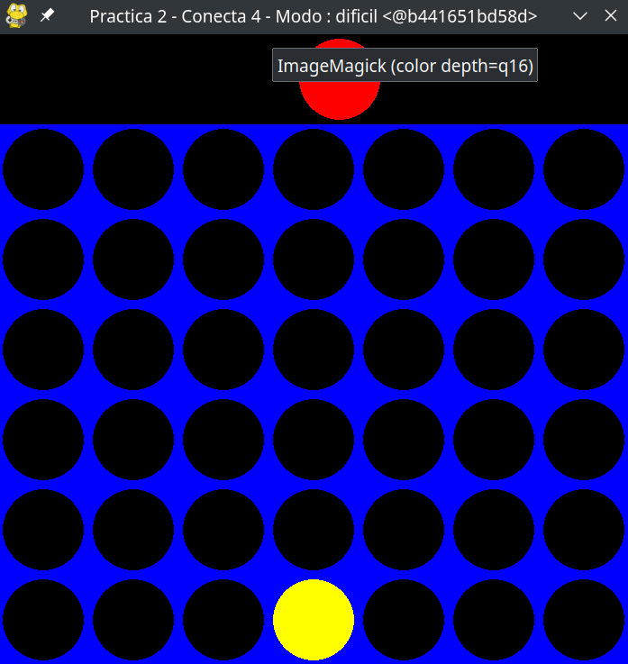

# Practica 2 - IA: Conecta 4

## Datos tecnicos 
- **Nombre:** Juan Mario Sosa Romo
- **Fecha** 13/03/25

Este proyecto implementa el juego **Conecta 4** en Python utilizando **pygame** y agrega una IA medio "tonta" que usa el algoritmo de minimax y alfa-beta prunning. El juego permite seleccionar la dificultad a través de un argumento en la línea de comandos (por ejemplo, `facil`, `medio` o `dificil`).

## Instrucciones de Ejecución

### Primera forma, a lo bruto teniendo todo instalado

#### Solo ejecuta en tu terminal, en donde estan los archivos del juego
```bash
python3 conecta4Juego.py <dificultad>
```

### Segunda forma, usando dockergod. Ojo solo funciona en linux porque windows suckea

#### 1. Permitir acceso a X11
En la terminal, ejecuta:
```bash
xhost +local:root
```

#### 2. Construye la imagen Docker
En donde esta el Dokcerfile, ejecuta:
```bash
docker build -t conecta4 .
```

#### 2. Construye la imagen Docker
En donde esta el Dokcerfile, ejecuta:
```bash
docker run -it -e DISPLAY=$DISPLAY -v /tmp/.X11-unix:/tmp/.X11-unix conecta4 <difficultad>
```

##### Nota:

Si no se especifica la dificultad, por defecto sera dificil que es pesado. Es normal que tarde un poco pero si todo sale bien tendras una pantalla algo asi: 



